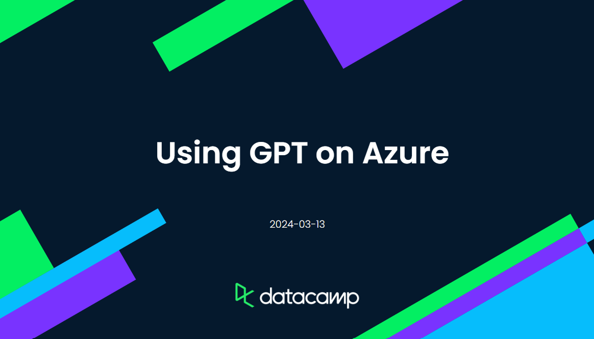
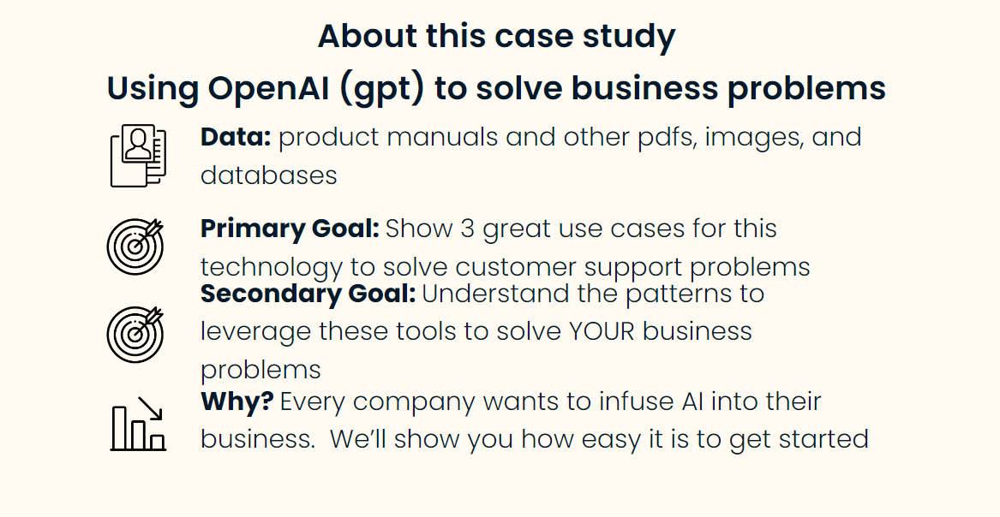

# datacamp Code-Along -- Using OpenAI (ChatGPT) on Azure



Dave Wentzel  
Data Scientist  
Microsoft Technology Center - Philly  
[LinkedIn Profile](https://linkedin.com/in/dwentzel)  

March 13, 2024  
11:00 - 12:00 (American EST)  

**If you have questions at any time, just stop me and ask away.  I would rather this be conversational vs everyone watching me.  If you have questions after the event just HMU on [LinkedIn](https://linkedin.com/in/dwentzel).**

# Abstract

This session is geared to helping an aspiring data scientist leverage some of the tools on Microsoft Azure to do their work.  While geared towards Azure, most of these concepts and tools are available on other clouds, docker containers, etc.  Please stop me at any point if you have questions.  

You can find my resources and code in the [github repo](https://github.com/davew-msft/datacamp-azuregpt)



# Business Use Case

You can watch the [youtube video on this solution here](https://youtu.be/-6nN4M9juIo?si=MiibXCg5xjbnlZnl&t=90)

The real questions folks have about OpenAI is... *how can this help my business?*  This little demo/codeo-along will help you with 3 business problems this tech can solve that every business has:  
* **content**:  business have a lot of content that is _unstructured_ (meaning not in databases) that they struggle to leverage.  Images, pdfs, etc.  It can even help to create content.  
* **support**:  how can you help your support folks be more productive, or provide self-service support to your users?
* **sales**:  Companies are in business to sell things and make money, and this technology can help.  


# Setup Your Environment

All of the code is available from Microsoft's Samples repo.  

1. Install vscode
1. [AOAI Approval Process](https://learn.microsoft.com/en-us/azure/ai-services/openai/overview#how-do-i-get-access-to-azure-openai).  You will need this...it only takes about an hour to get approval.  It doesn't cost anything, Microsoft is simply tracking what folks _intend_ to use the service for so they can plan accordingly.  
2. [clone the samples repo](https://github.com/Azure-Samples/contoso-chat) and follow the instructions.  

```git clone https://github.com/Azure-Samples/contoso-chat```

**This repo is under active development.  I know for certain that the code works if we also set the branch this way.**

```git checkout -b datacamp-cc2e808e cc2e808e```

*Follow that repo for exact requirements and setup instructions.  That repo is maintained and constantly being updated.* 

3. *Optional*:  if you want to deploy the website as well that I demo'd and is in the video then you can use [this gh repo](https://github.com/Azure-Samples/contoso-web)

```git clone https://github.com/Azure-Samples/contoso-web```

**To code all of this yourself, simply follow along with those repos/instructions. In the interests of time, I'll take you through some interesting things to note during this session.**

# Solution Discussion

* where is the unstructured data stored?  
* how is it indexed?  
  * what is a `vector`?  
* where is the customer info stored?  Why is it in cosmosdb?  What is cosmosdb?
* What is `PromptFlow`?  


# Resources

* [this github repo](https://github.com/davew-msft/datacamp-azuregpt)
* [samples repo](https://github.com/Azure-Samples/contoso-chat)


